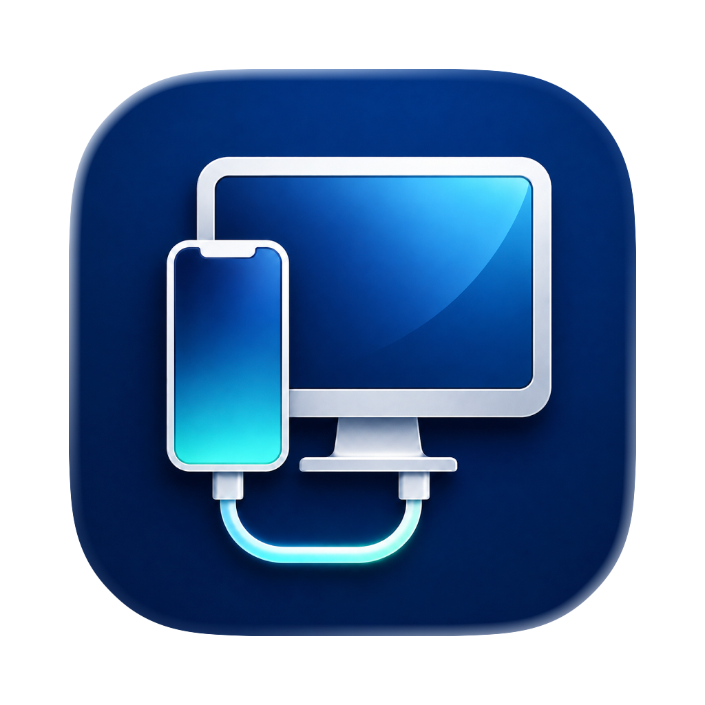
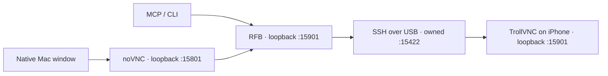

<p align="center">
  
</p>
<h1 align="center">iPhoneBridge</h1>
<p align="center"><strong>Your iPhone. On your Mac. Over USB.</strong></p>
<p align="center">A native Mac window for live iPhone mirroring, keyboard input, and agent control.</p>
<p align="center">
  <a href="https://github.com/net-snix/iPhoneBridge/actions/workflows/ci.yml"></a>
  <a href="https://github.com/net-snix/iPhoneBridge/releases/latest"></a>
  
  
  <a href="THIRD_PARTY.md"></a>
</p>
<p align="center">
  <a href="https://github.com/net-snix/iPhoneBridge/releases/latest"><strong>Download the app</strong></a> ·
  <a href="#get-connected">Get connected</a> ·
  <a href="docs/BUILDING.md">Build from source</a> ·
  <a href="THIRD_PARTY.md">Credits & licenses</a>
</p>

> **Made for jailbroken iPhones.** The release supports Apple silicon Macs running macOS 26+ and a jailbroken iPhone on **iOS 15.1.1**, with existing SSH key access as `mobile`. Tested on iPhone 13 Pro. Other iOS versions are rejected; other hardware on that version is unverified. Stock iPhones are not supported.

## A little window. A real iPhone.

| | What you get |
| :--- | :--- |
| 🖥️ **Native on the Mac** | AppKit window, full screen, resizing, and automatic portrait/landscape layout. |
| 👆 **Direct interaction** | Click, drag, scroll with a drag, and type using your Mac keyboard. |
| ⌘ **Phone navigation** | Home Screen with **⌘1**, App Switcher with **⌘2**, plus toolbar buttons. |
| 🔌 **USB transport** | Loopback endpoints carried over an owned SSH tunnel. No account or cloud relay. |
| 📦 **Self-contained app** | Python, USB utilities, viewer, and phone daemon are bundled. No Homebrew or checkout needed to run. |
| 🤖 **Agent access** | Six MCP tools for screenshots, taps, drags, text, keys, and health. |

The mirror targets 60 fps at full resolution. A development build measured about **55 fps during motion** and **98 ms input-to-visible latency** on the tested phone. These are recorded measurements, not a guarantee for every device or the rebuilt release daemon; see [performance evidence and limits](PERFORMANCE.md).

## Get connected

1. Download the app ZIP from [Releases](https://github.com/net-snix/iPhoneBridge/releases/latest), unzip it, and move **iPhoneBridge.app** into **Applications**.
2. Connect the iPhone by USB, unlock it, and trust the Mac. The jailbreak and SSH server must already be working, with key authentication as `mobile`.
3. Open iPhoneBridge. It selects the only connected iPhone automatically and starts the mirror.
4. For multiple devices or a custom SSH key, use **iPhoneBridge → Settings…**. Select the phone and an existing key, then choose **Save & Connect**. Only the key's path is saved.

The initial release is **ad-hoc signed, without Apple notarization**. macOS may require **System Settings → Privacy & Security → Open Anyway** after the first launch attempt. See [Apple's instructions](https://support.apple.com/102445). Source builds are available if you prefer to build it yourself.

Keep the phone awake and unlocked. Use **View → Reconnect** after reconnecting a cable. To close a phone app, open App Switcher, find its card, and drag it upward off the screen. Home follows the phone's native behavior: from the switcher, it may first return to the selected app.

Quitting stops this bridge's recorded processes, including an agent session using the same connection. Unrelated tunnels are preserved. The app deploys its own daemon under `/var/mobile/Media/iPhoneBridge`; it does not install a jailbreak, update iOS, or add a persistent service.

**Current limits:** single-finger input; ASCII typing with a US hardware keyboard mapping; no pinch/multitouch, audio forwarding, notifications, or locked-phone continuity. Rotation changes the framebuffer dimensions. Keep human and agent input separate in time.

## Agent and command-line access

The standalone app contains its CLI at:

```sh
"/Applications/iPhoneBridge.app/Contents/Helpers/bridge" health
"/Applications/iPhoneBridge.app/Contents/Helpers/bridge" screenshot
```

To register the MCP server with Codex:

```sh
codex mcp add iphonebridge -- "/Applications/iPhoneBridge.app/Contents/Helpers/bridge" mcp
```

Open the app first, or run the helper's `connect` command. Starting MCP alone does not launch the phone services. Available tools: `screenshot`, `tap`, `drag`, `type_text`, `key`, and `health`.

Always take a fresh screenshot, use its **raw pixel dimensions**, and inspect the returned image after an action. Input calls require those dimensions; stale orientation is rejected. The CLI also exposes `navigate home` and `navigate app-switcher`. See [CLI and MCP usage](docs/USAGE.md) for examples and recovery.

## How it fits together



All listeners bind to loopback. SSH authenticates and protects the USB hop; RFB has no separate password, so local processes on either device can reach its local endpoint. Clipboard sharing, file transfer, Bonjour, and the daemon's built-in HTTP server are disabled.

Settings, logs, screenshots, and cleanup records live in `~/Library/Application Support/iPhoneBridge/`. SSH host keys are kept in a separate known-hosts file. Device selection never resets USB pairing. See [validation](VALIDATION.md) for what was actually tested.

## Built on open source

The bridge combines [TrollVNC](https://github.com/owngoal-dev/TrollVNC), [LibVNCServer](https://github.com/LibVNC/libvncserver), [noVNC](https://github.com/novnc/noVNC), [libimobiledevice](https://libimobiledevice.org/), [vncdotool](https://github.com/sibson/vncdotool), [websockify](https://github.com/novnc/websockify), and [MCP](https://modelcontextprotocol.io/), with a Swift AppKit shell. Thanks to their maintainers. This software is based in part on the work of the Independent JPEG Group.

Original bridge code and artwork are [MIT licensed](LICENSE). The bundled daemon is **GPL-2.0-only**; other components retain their GPL, LGPL, MPL, and permissive terms. The app download includes notices, and every binary release includes a **corresponding-source archive** with exact dependency sources, patches, and rebuild instructions. Read [THIRD_PARTY.md](THIRD_PARTY.md) for the component-by-component license map.

[Build guide](docs/BUILDING.md) · [Release checklist](docs/RELEASING.md) · [Performance](PERFORMANCE.md) · [Changelog](CHANGELOG.md)
